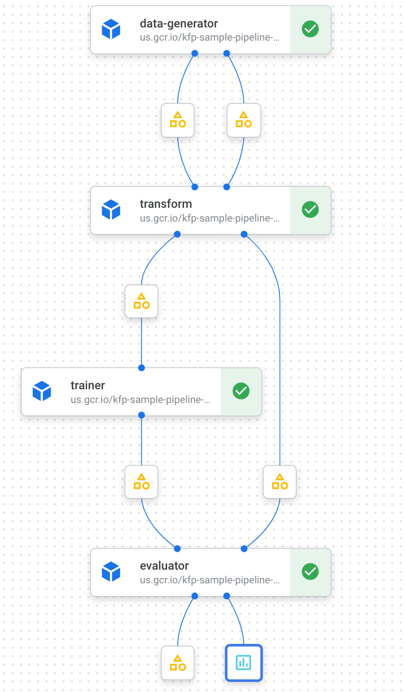

# Penguin Classification Pipeline on Kubeflow Pipelines

Penguin classification pipeline introduces modern ML pipeline development using Kubeflow Pipelines (KFP SDK v2) on Google Cloud Vertex Pipelines.

## Architecture & Design Spec

For in-depth design patterns, containerization principles, and technical rationales, see the [Architecture & Design Spec](docs/ARCHITECTURE.md).

## Dataflow



## Two Pipeline Variations

This repository provides two pipeline definitions (`pipeline_container.py` and `pipeline_component.py`). Both pipelines execute the exact same machine learning workflow (Palmer Penguins data retrieval, feature suffix transformation, Random Forest model training, and evaluation):

1. **Container Pipeline** (`pipeline_container.py` -> `kfp_container_pipeline.yaml`):
   - CLI-based orchestration invoking each component container via command-line arguments using `@dsl.container_component`.
   - Offers high affinity with standard container execution patterns and decoupled container toolchains.

2. **Native KFP Component Pipeline** (`pipeline_component.py` -> `kfp_component_pipeline.yaml`):
   - Pythonic component orchestration using `@dsl.component` operations (`*_op`) exported from component packages (`components.<name>`).
   - Fully utilizes KFP v2 first-class Artifacts (`Dataset`, `Model`, `Metrics`, `ClassificationMetrics`).
   - Automatically tracks metadata in Vertex MLMD and renders interactive confusion matrix widgets in the Vertex AI console.

## Quick Start & Testing

### 1. Environment Setup

Install project dependencies and set up the local virtual environment with `uv`:

```bash
uv sync
```

### 2. Run Test Suite

Run the full automated test suite (component domain logic, CLI adapters, KFP component adapters, and pipeline compilation):

```bash
uv run pytest
```

### 3. Compile Pipelines

Compile either or both pipelines into standard KFP v2 Intermediate Representation (IR YAML):

#### Container Pipeline

Compile the CLI-based container pipeline into `kfp_container_pipeline.yaml`:

```bash
uv run python pipeline_container.py
```

#### Native KFP Component Pipeline

Compile the native KFP component pipeline into `kfp_component_pipeline.yaml`:

```bash
uv run python pipeline_component.py
```

### 4. Build Containers & Deploy to Vertex AI

Follow the step-by-step instructions in the [Deployment Guide](DEPLOYMENT.md) to build `linux/amd64` container images via Docker Buildx / Cloud Build and submit jobs to Vertex AI Pipelines.

## Pipeline Parameters

- `dataset_url` : `str`
  - URL or path to download raw Palmer Penguins CSV data (default: official TensorFlow Dataset GCS URL).
- `suffix` : `str`
  - Suffix appended to preprocessed feature column names (default: `_xf`).
- `n_estimators` : `int`
  - Number of trees in the Random Forest classifier (default: `100`).
- `random_state` : `int`
  - Random seed for reproducible dataset splitting and training (default: `42`).

## Components & Artifacts

The pipeline consists of 4 container components located under `components/`:

### 1. Data Generator (`components/data_generator`)
Fetches the Palmer Penguins dataset and splits it into training and evaluation partitions.
- Inputs: `dataset_url` (`str`), `test_size` (`float`), `random_state` (`int`)
- Outputs:
  - `train_data`: `dsl.Output[dsl.Dataset]` (Raw train CSV)
  - `eval_data`: `dsl.Output[dsl.Dataset]` (Raw eval CSV)

### 2. Transform (`components/transform`)
Preprocesses train/eval data by adding the specified suffix to column names.
- Inputs:
  - `train_data`: `dsl.Input[dsl.Dataset]`
  - `eval_data`: `dsl.Input[dsl.Dataset]`
  - `suffix`: `str`
- Outputs:
  - `transformed_train_data`: `dsl.Output[dsl.Dataset]`
  - `transformed_eval_data`: `dsl.Output[dsl.Dataset]`

### 3. Trainer (`components/trainer`)
Trains a Random Forest classifier using scikit-learn on the transformed training dataset.
- Inputs:
  - `transformed_train_data`: `dsl.Input[dsl.Dataset]`
  - `suffix`: `str`
  - `n_estimators`: `int`
  - `random_state`: `int`
- Outputs:
  - `trained_model`: `dsl.Output[dsl.Model]` (Model pickle artifact)

### 4. Evaluator (`components/evaluator`)
Evaluates the trained model against the transformed evaluation dataset, logging quantitative accuracy and confusion matrix.
- Inputs:
  - `trained_model`: `dsl.Input[dsl.Model]`
  - `transformed_eval_data`: `dsl.Input[dsl.Dataset]`
  - `suffix`: `str`
- Outputs:
  - `metrics`: `dsl.Output[dsl.Metrics]` (Accuracy metric in Vertex MLMD)
  - `classification_metrics`: `dsl.Output[dsl.ClassificationMetrics]` (Interactive Confusion Matrix visualized in Vertex AI console)
