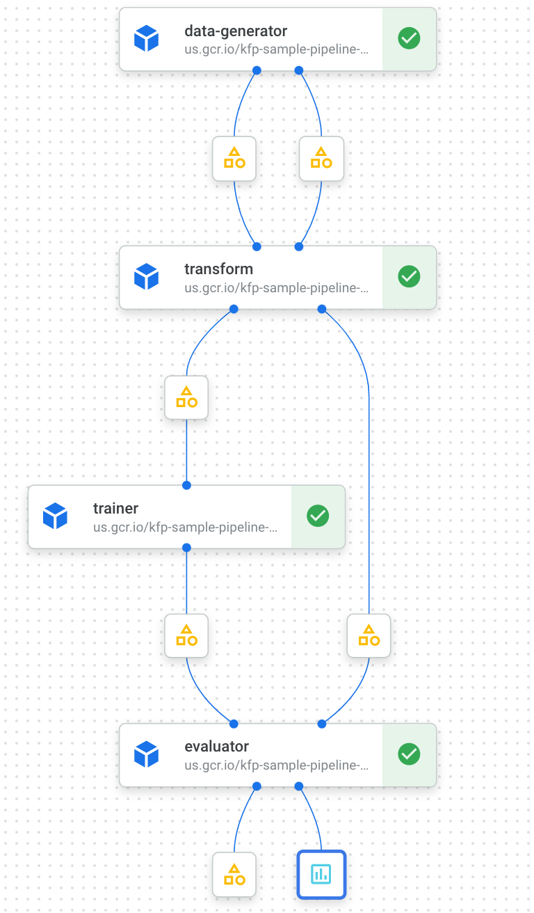

# Repro Lab Sample Pipelines

Two simple sample pipelines are introduced on this repo with both KFP SDK and TFX SDK.

## KFP SDK

Penguin classification pipeline with KFP SDK. To try to run this pipeline, check [this document](kfp/).

## TFX SDK

- TBD

## Future Work

### KFP SDK

- [ ] Add unit test
- [ ] Migrate from `GCSPath` into `Artifact`
- [ ] Pipeline E2E test
- [ ] Add Pusher component

### TFX SDK

- [ ] Add sample example pipeline 😃
