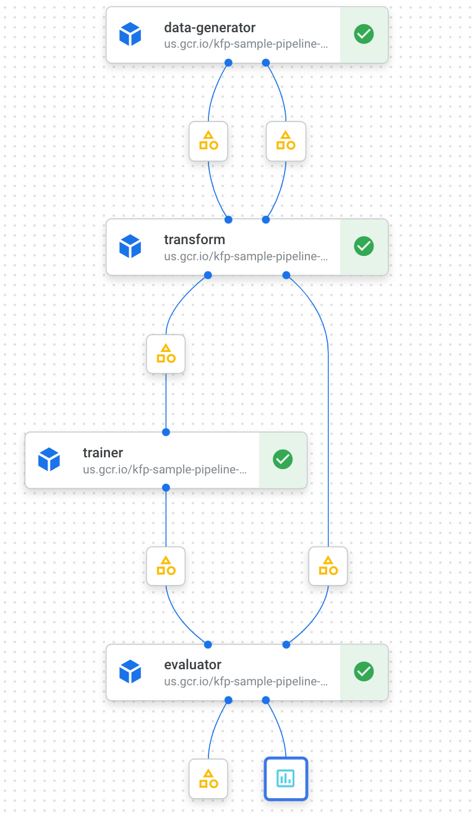

# Penguin Classification Pipeline on Kubeflow Pipelines

Penguin classification pipeline introduces the basics of the KFP SDK v2 programming. It uses almost all of the Kubeflow Pipelines.

## How to deploy.

To deploy kfp sample pipeline, check [this document](DEPLOYMENT.md).
## Requirements

Setup followings;

- Python 3.x (Tested on Python 3.8.10)
- poetry
- Docker (Tested on Docker for mac 3.2.2)

## Dataflow

## Pipeline Parameters

- Suffix : `str`
  - Suffix for preprocessed features. This is used for pseudo "preprocessing". Default value is `_xf`.

## Components

### Data Generator

The Data Generator downloads the [processed Palmer Penguins dataset](https://storage.googleapis.com/download.tensorflow.org/data/palmer_penguins/penguins_processed.csv) and split it into train/eval data.

#### Input / Output

Consumes: 

- Nothing

Emits:

- Train data
- Eval data

### Transform

The Transform pre processes train/eval data. Because this pipelines consumes already preprocessed data, this component simply add suffix for each column name. Default suffix is  `_xf`.

#### Input / Output

Consumes:

- Train data
- Eval data
- Suffix

Emits:

- Preprocessed train data
- Preprocessed eval data

### Trainer

The Trainer trains the ML model using the dataset from the Transform. ML model is based on scikit-learn model.

Consumes:

- Preprocessed train data
- Suffix

Emits:

- Trained model

### Evaluator

Evaluator evaluates the trained model by eval dataset. Evaluator use accuracy for the metric of the trained model and confusion matrix for visualization.

Consumes:

- Trained model
- Preprocessed eval dataset
- Suffix

Emits:

- Accuracy
- Confusion matrix
